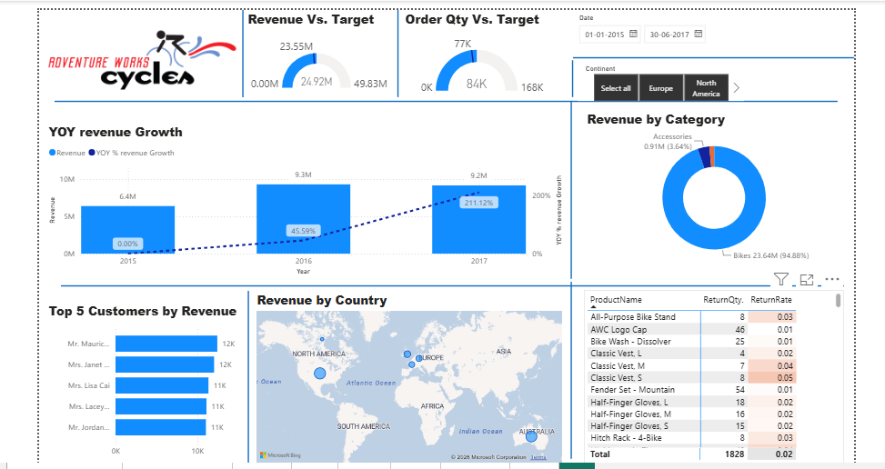

# 📊 Top Line Report

## 📌 Project Overview
This Power BI dashboard provides an interactive analysis of business performance using KPIs, charts, trends, and slicers to help users make data-driven decisions.

## 🖼 Dashboard Preview

## 🛠 Tools & Technologies
- Power BI
- Power Query
- DAX
- Excel

## 📈 Key Features
- Interactive slicers
- KPI Cards
- Trend Analysis
- Business Performance Overview
- Dynamic Visualizations

## 📂 Files Included
- 📊 Top Line Report.pbix
- 📄 Top Line Report.pdf
- 🖼 dashboard.png

---
⭐ If you like this project, feel free to star this repository!
